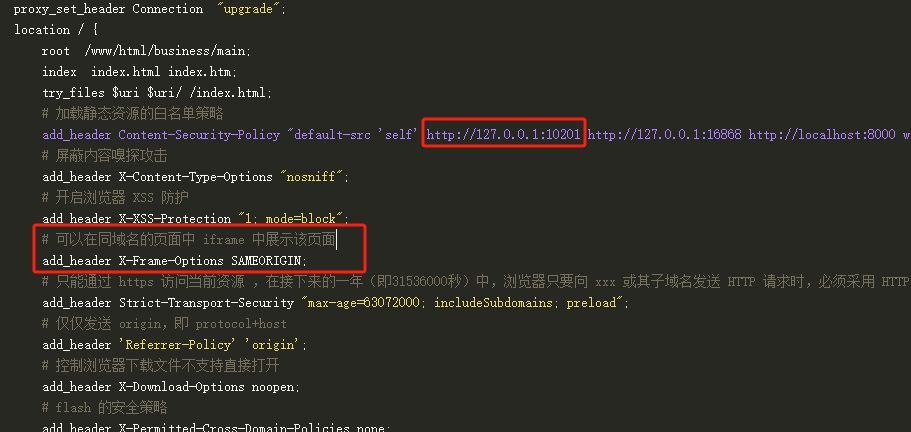

# some-issues-in-front-end-development
Handling of some issues in front-end developmentSome issues in front-end development，前端开发的一些问题处理
# 1、Windows7下在浏览器中上传ofd文件file.type可能为空，Windows10下正常
   不能使用file.type作为文件类型判断，需要使用file.name的后缀判断ofd文件 
   例如  
    const fileName = file.name || file.fileName 
    const indexf = fileName.lastIndexOf('.') 
    const fileType = fileName.substring(indexf).toLowerCase() 
    if( fileType==='ofd'){ 
    //通过ofd文件类型验证 
    } 
# 2、浏览器上能正常访问的网址，嵌入iframe后提示内容被屏蔽的问题处理
  检查nginx或tomcat服务器上的add_header Content-Security-Policy白名单策略配置，是有将需要嵌入的网址域名加端口添加进去; 
  如果已经添加并重启还是不能访问，可能是别人服务器添加了限制，例如add_header X-Frame-Options SAMEORIGIN;（ 可以在同域名的页面中 iframe 中展示该页面），需要别人处理; 
   
